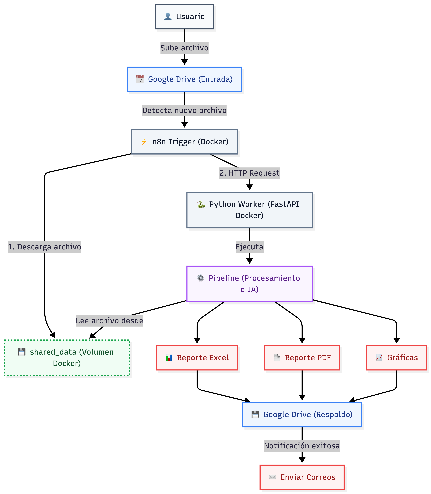
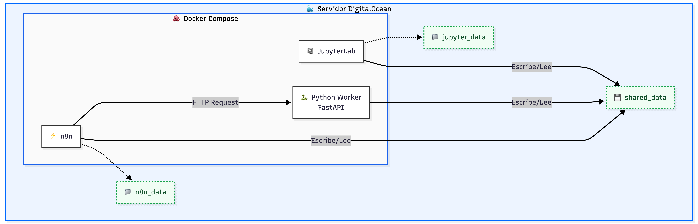
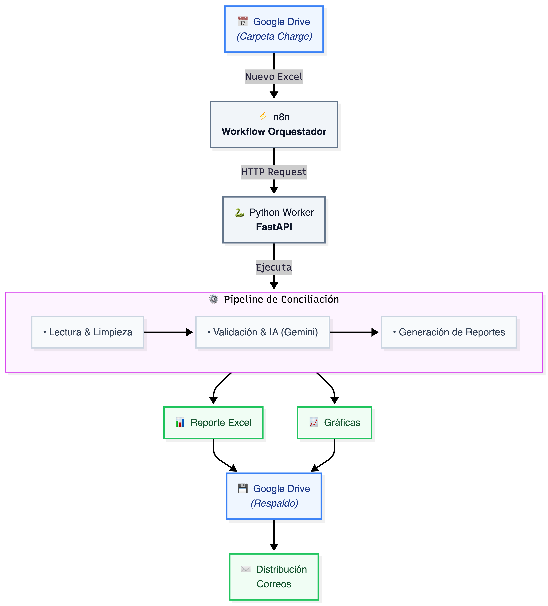
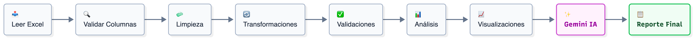
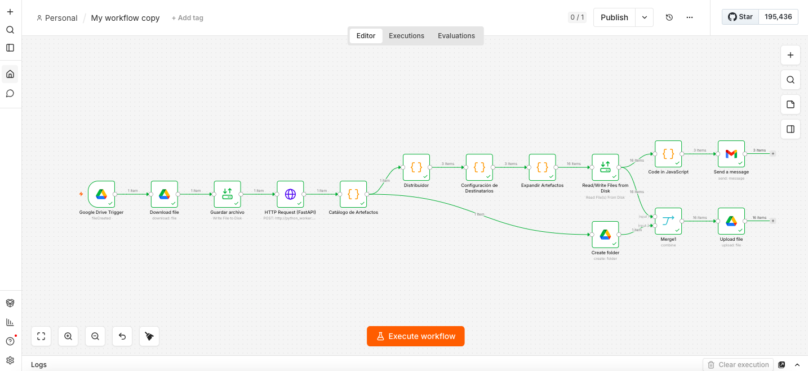
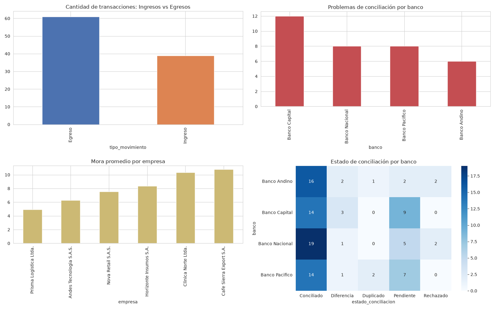

# Pipeline de Conciliación Bancaria Automatizado

Sistema de análisis y conciliación financiera que integra un pipeline de procesamiento de datos en Python, inteligencia artificial generativa (Gemini) y automatización de flujo de trabajo (n8n), desplegado sobre contenedores Docker en un servidor DigitalOcean.

El sistema detecta automáticamente la llegada de un archivo Excel a una carpeta de Google Drive, lo procesa por completo (limpieza, validación, análisis, visualización y clasificación con IA) y distribuye los resultados por correo electrónico a los responsables de cada área — Analista, Gerencia de Riesgo y Equipo Operativo de Cartera — dejando además una copia de respaldo organizada por fecha en Google Drive.

---

## Tabla de contenido

- [Descripción del proyecto](#descripción-del-proyecto)
- [Objetivo de la automatización](#objetivo-de-la-automatización)
- [Arquitectura general](#arquitectura-general)
- [Tecnologías utilizadas](#tecnologías-utilizadas)
- [Estructura del repositorio](#estructura-del-repositorio)
- [Flujo completo del sistema](#flujo-completo-del-sistema)
- [Componentes del sistema](#componentes-del-sistema)
- [Instalación y despliegue](#instalación-y-despliegue)
- [Variables de entorno](#variables-de-entorno)
- [Ejecución local y en producción](#ejecución-local-y-en-producción)
- [Diagramas e imágenes](#diagramas-e-imágenes)
- [Posibles mejoras futuras](#posibles-mejoras-futuras)
- [Documentación adicional](#documentación-adicional)
- [Créditos y licencia](#créditos-y-licencia)

---

## Descripción del proyecto

Este proyecto resuelve la conciliación bancaria de transacciones entre múltiples empresas y bancos, un proceso que manualmente implica revisar grandes volúmenes de datos, identificar mora crítica, detectar inconsistencias contables (signos, valores netos, fechas) y comunicar los hallazgos a distintas audiencias con necesidades de información diferentes.

El sistema automatiza ese ciclo de punta a punta: desde la llegada del archivo hasta la entrega de resultados accionables a cada equipo, sin intervención manual.

## Objetivo de la automatización

- Eliminar la ejecución manual del análisis cada vez que llega un dataset nuevo.
- Garantizar que los datos se validen contra reglas de negocio antes de generar cualquier reporte.
- Producir, de forma consistente, un conjunto de artefactos especializados (reportes, gráficas, clasificación de alertas) en lugar de un único documento genérico.
- Entregar a cada destinatario únicamente la información relevante para su rol.
- Mantener trazabilidad de cada ejecución mediante un historial de resultados organizado por fecha.

---

## Arquitectura general

El sistema está compuesto por tres capas con responsabilidades estrictamente separadas, comunicadas exclusivamente mediante una API REST y un volumen de archivos compartido:

```
Google Drive  ──►  n8n (orquestación)  ──►  Python Worker (FastAPI)  ──►  Pipeline de Conciliación
     ▲                                                                            │
     └────────────────────────── respaldo de resultados ◄─────────────────────────┘
```

- **n8n** no conoce la lógica del pipeline.
- **El pipeline** no conoce n8n.
- Toda la comunicación ocurre a través de una API HTTP y de un volumen de archivos compartido (`/shared`).

---

## Tecnologías utilizadas

**Procesamiento de datos y backend**
- Python 3
- pandas
- Pandera (validación de esquemas de datos)
- openpyxl (reportes Excel multipestaña)
- matplotlib / seaborn (visualizaciones)
- FastAPI + Pydantic
- Uvicorn (servidor ASGI)

**Inteligencia artificial**
- Google Gemini (`google-genai`) — generación de reporte ejecutivo y clasificación de alertas

**Automatización e integración**
- n8n — orquestación del flujo end-to-end
- Google Drive API (OAuth 2.0) — trigger de archivos y respaldo de resultados
- Gmail API (OAuth 2.0) — distribución de resultados por correo

**Infraestructura**
- Docker / Docker Compose
- Portainer — gestión del stack
- DigitalOcean — servidor donde corre la infraestructura
- JupyterLab — entorno de desarrollo del pipeline

---

## Estructura del repositorio

```
.
├── data/
│   ├── notebook/                  # Cuadernos originales de exploración (Jupyter).
│   │                              # Aquí nació el proyecto; se conservan como
│   │                              # referencia, no se ejecutan en producción.
│   │
│   ├── src/                       # Código productivo real del pipeline. Esto es
│   │   │                          # lo que corre en el servidor (Docker), expuesto
│   │   │                          # vía app.py y disparado por n8n.
│   │   ├── main.py                # Orquestador del pipeline (CLI y programático)
│   │   ├── config.py              # Rutas de salida y umbrales de negocio
│   │   ├── paso1_lectura.py       # Lectura y auditoría inicial del Excel
│   │   ├── paso2_limpieza.py      # Limpieza y reglas de negocio
│   │   ├── paso3_analisis.py      # Reporte analítico en Excel
│   │   ├── paso4_visualizacion.py # Generación de gráficas
│   │   ├── paso5_ia.py            # Reporte ejecutivo y clasificación con Gemini
│   │   ├── paso_validacion.py     # Esquemas y validación con Pandera
│   │   └── requirements.txt
│   │
│   ├── app.py                     # API FastAPI que expone el pipeline como servicio
│   │
│   ├── workflow/
│   │   └── workflow.json          # Workflow exportado de n8n
│   │
│   ├── raw/                       # Archivos de prueba para demostrar el
│   │                              # funcionamiento del pipeline (nulos,
│   │                              # duplicados, fechas mal formateadas, etc.)
│   │
│   ├── processed/                 # Archivo Excel ya limpio, generado por el
│   │                              # pipeline tras limpieza/validación/transformación
│   │
│   └── output/                    # Resultado de UNA ejecución de ejemplo
│                                  # (reportes, gráficas, clasificación IA).
│                                  # NOTA: no necesariamente corresponde 1 a 1
│                                  # con los archivos que hoy están en raw/;
│                                  # es solo material de demostración del
│                                  # formato de salida.
│
├── docs/
│   ├── images/                    # Diagramas y capturas referenciadas en la documentación
│   └── architecture/
│       ├── overview.md                     # Arquitectura del sistema (estado actual)
│       ├── evolution.md                    # Historia y evolución del proyecto
│       └── architectural-decisions.md      # Decisiones de arquitectura documentadas
│
├── docker-compose.yml             # Stack: jupyterlab, n8n, python-worker
├── .env.example                   # Variables de entorno necesarias (sin secretos)
└── README.md

```
---

## Flujo completo del sistema

1. Un archivo Excel se sube a una carpeta monitoreada de Google Drive.
2. n8n detecta el archivo (Google Drive Trigger), lo descarga y lo guarda en el volumen compartido `/shared`.
3. n8n invoca `POST /procesar` en el Python Worker, indicando la ruta del archivo.
4. El Python Worker ejecuta el pipeline completo:
   - Lectura y auditoría inicial del Excel.
   - Validación estricta de datos crudos (Pandera).
   - Limpieza y aplicación de reglas de negocio, con persistencia del archivo limpio.
   - Validación estricta post-limpieza (Pandera).
   - Generación de reporte analítico en Excel (múltiples vistas).
   - Generación automática de gráficas.
   - Generación de reporte ejecutivo (Markdown) y clasificación de alertas (JSON) mediante Gemini.
5. El Worker responde con la ruta donde quedaron los resultados (`output_dir`).
6. n8n construye un catálogo de los artefactos generados y arma paquetes diferenciados por destinatario (Analista, Gerencia de Riesgo, Equipo Operativo de Cartera).
7. n8n lee los archivos necesarios desde disco (un único nodo de lectura, reutilizado para todos los artefactos) y envía un correo por destinatario con sus adjuntos correspondientes.
8. En paralelo, se crea una carpeta con nombre basado en fecha y hora en Google Drive, y se sube ahí una copia de respaldo de los resultados.

> **Figura 1. Flujo completo del sistema, de Google Drive a la distribución final**
>
> 

### Matriz de distribución de artefactos por destinatario

| Artefacto | Analista | Gerencia de Riesgo | Equipo Operativo de Cartera |
|---|:---:|:---:|:---:|
| Reporte ejecutivo (.md) | ✅ | ✅ | |
| Reporte estructurado (.xlsx) | ✅ | | |
| Datos limpios (.xlsx) | ✅ | ✅ | ✅ |
| Clasificación de alertas (.json) | ✅ | | ✅ |
| Gráfica: ingresos vs. egresos | ✅ | ✅ | |
| Gráfica: problemas por banco | ✅ | ✅ | |
| Gráfica: mora por empresa | ✅ | ✅ | |
| Gráfica: heatmap bancos | ✅ | ✅ | |

---

## Componentes del sistema

### n8n
Orquesta el flujo completo: detecta archivos nuevos en Google Drive, los descarga, invoca la API del pipeline, construye el catálogo de artefactos, decide qué archivos corresponden a cada destinatario, envía los correos y sube el respaldo a Drive. No contiene lógica de negocio ni realiza cálculos financieros.

### Python Worker (FastAPI)
Expone el pipeline como un servicio HTTP. Su única responsabilidad es recibir una solicitud, ejecutar el pipeline importado desde el volumen compartido y devolver la ubicación de los resultados. No contiene lógica de negocio propia; toda la lógica vive en el pipeline.

**Endpoints:**

| Método | Ruta | Descripción |
|---|---|---|
| `GET` | `/` | Health check del servicio. |
| `POST` | `/procesar` | Recibe `{"file_path": "..."}`, ejecuta el pipeline y devuelve `{"estado": "OK", "output_dir": "..."}`. |

### Pipeline de Conciliación Bancaria
Conjunto de módulos en Python responsables de la lógica de negocio: lectura y auditoría inicial, validación estricta con Pandera (antes y después de la limpieza), limpieza y reglas de negocio, generación de reportes analíticos, generación de visualizaciones, e interpretación y clasificación mediante Gemini, incluyendo control de calidad para mitigar alucinaciones y manejo de límites de tasa de la API.

### JupyterLab
Entorno de desarrollo donde se edita el código del pipeline. El mismo volumen donde vive ese código se monta como solo lectura dentro del Python Worker, evitando duplicar código entre el entorno de desarrollo y el de ejecución.

### Almacenamiento compartido
Un volumen Docker (`shared_data`), montado en los tres servicios bajo `/shared`, es el único mecanismo de intercambio de archivos entre ellos. Cada ejecución del pipeline genera una carpeta propia dentro de `/shared/processed/`, nombrada con la fecha y hora de la ejecución, lo que permite conservar un historial completo de resultados. Actualmente los resultados se conservan de forma indefinida hasta que se eliminan manualmente; no existe un proceso automático de limpieza o expiración.

> **Figura 2. Contenedores, volúmenes y comunicación entre servicios**
>
> 

---

## Instalación y despliegue

### Requisitos previos

- Docker y Docker Compose (o Portainer administrando el host).
- Una cuenta de Google Cloud con OAuth 2.0 configurado (pantalla de consentimiento, Redirect URI, Google Drive API habilitada) para la credencial de Google Drive en n8n.
- Credencial OAuth 2.0 de Gmail configurada en n8n.
- Una API Key de Google Gemini.

### Clonar el repositorio

```bash
git clone <url-del-repositorio>
cd <nombre-del-repositorio>
```

### Configurar variables de entorno


### Levantar el stack

```bash
docker compose up -d
```

Esto levanta tres servicios:

- `jupyterlab` — entorno de desarrollo del pipeline, puerto `8888`.
- `n8n` — orquestación, puerto `5678`.
- `python-worker` — API interna del pipeline, accesible solo desde la red interna de Docker.

### Configurar n8n

1. Importar `n8n/workflow.json` en la instancia de n8n.
2. Configurar la credencial de Google Drive (OAuth 2.0) y seleccionar la carpeta a monitorear.
3. Configurar la credencial de Gmail (OAuth 2.0).
4. Activar el workflow.

---

## Variables de entorno

| Variable | Servicio | Descripción |
|---|---|---|
| `JUPYTER_TOKEN` | jupyterlab | Token de acceso a JupyterLab. |
| `N8N_HOST` | n8n | Host/dominio bajo el cual se expone n8n. |
| `N8N_PROTOCOL` | n8n | Protocolo (`https`) usado por n8n para construir URLs internas. |
| `WEBHOOK_URL` | n8n | URL base usada por n8n para webhooks. |
| `N8N_PORT` | n8n | Puerto interno de n8n. |
| `N8N_SECURE_COOKIE` | n8n | Configuración de cookies seguras de n8n. |
| `N8N_RESTRICT_FILE_ACCESS_TO` | n8n | Restringe el acceso a archivos de n8n a la ruta indicada (`/shared`). |
| `GEMINI_API_KEY` | python-worker | API Key utilizada por el pipeline para las llamadas a Gemini. |

---

## Ejecución local y en producción

### Ejecución local del pipeline (sin n8n ni Docker)

```bash
cd data/src
python main.py archivo.xlsx
```

Si no se especifica un archivo, el pipeline busca automáticamente el primer `.xlsx` disponible en la carpeta.

### Ejecución local vía API (con el Worker corriendo)

```bash
curl -X POST http://localhost:8000/procesar \
  -H "Content-Type: application/json" \
  -d '{"file_path": "/shared/archivo.xlsx"}'
```

### Ejecución en producción

En producción, el flujo se dispara automáticamente al subir un archivo a la carpeta de Google Drive monitoreada por n8n. No se requiere intervención manual: n8n descarga el archivo, invoca al Python Worker, y distribuye los resultados según el workflow configurado.

---

## Diagramas e imágenes

### Arquitectura general
| 
Diagrama de alto nivel: Google Drive → n8n → Python Worker → Pipeline, con las flechas de respaldo hacia Drive. 

### Flujo de fases del pipeline
|
Diagrama de las fases internas del pipeline (lectura → validación → limpieza →
validación → análisis → visualización → IA).

### Workflow de n8n
|
Captura del workflow de n8n: trigger, catálogo, distribuidor, envío de correos,
respaldo en Drive. Para el detalle completo del flujo, ver `n8n/workflow.json`.

### Gráficas generadas por el pipeline
|
Muestra de las gráficas generadas automáticamente por el pipeline (ingresos vs.
egresos, problemas por banco, mora por empresa, heatmap de conciliación).

---

## Posibles mejoras futuras

- **Política de retención automática** para las carpetas de resultados en `/shared/processed/`, que actualmente se conservan de forma indefinida hasta su eliminación manual.
- **Catálogo dinámico de artefactos** en n8n: en lugar de un catálogo de artefactos esperados, leer directamente los archivos existentes en `output_dir`, adaptándose automáticamente si el pipeline agrega o elimina artefactos.
- **Observabilidad centralizada**: consolidar logs de n8n, Python Worker y pipeline en un sistema de monitoreo común.
- **Manejo más robusto de cuotas de IA**: detección proactiva del estado de la cuota de Gemini antes de iniciar la fase de IA, en lugar de descubrirlo mediante el fallo de la llamada.
- **Pruebas automatizadas** para los módulos del pipeline (`paso1` a `paso5`) y para el contrato de la API del Python Worker.
- **Separación explícita** de los archivos de referencia (`api.py`, `apianterior.py`) que actualmente conviven junto al pipeline sin formar parte de la imagen de producción, para mantener el repositorio del pipeline libre de artefactos no utilizados.
- **Reemplazar sys.exit()** por respuestas HTTP estructuradas para que n8n pueda diferenciar errores técnicos de errores de validación de negocio.

---

## Documentación adicional

- [`docs/architecture/overview.md`](docs/architecture/overview.md) — arquitectura del sistema en su estado actual, componentes y flujo de datos en detalle.
- [`docs/architecture/evolution.md`](docs/architecture/evolution.md) — evolución histórica del proyecto, desde el primer script de limpieza de datos hasta la arquitectura actual.
- [`docs/architecture/architectural-decisions.md`](docs/architecture/architectural-decisions.md) — decisiones de arquitectura, con su contexto, alternativas consideradas y justificación.

---

## Créditos y licencia

**Desarrollado por:** *(completar con el nombre o usuario del autor)*

**Licencia:** este repositorio no cuenta actualmente con una licencia formal. Se recomienda incorporar una licencia (por ejemplo, MIT o Apache 2.0) antes de la publicación pública, según el uso que se le quiera dar al código.
